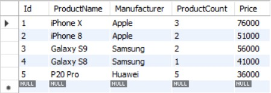
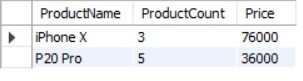
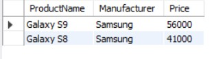
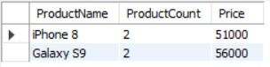
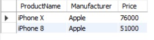
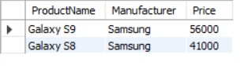
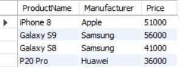
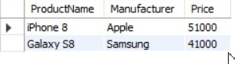

1. Создайте таблицу с мобильными телефонами, используя графический интерфейс. Заполните БД данными. Добавьте скриншот на платформу в качестве ответа на ДЗ

    

2. 	Выведите название, производителя и цену для товаров, количество которых превышает 2 (SQL - файл, скриншот, либо сам код)

    

3.  Выведите весь ассортимент товаров марки “Samsung”

    

4. 	Выведите информацию о телефонах, где суммарный чек больше   100 000 и меньше 145 000**

    

    *** С помощью регулярных выражений найти (можно использовать операторы “LIKE”, “RLIKE” для 4.3 ):

	4.1.  Товары, в которых есть упоминание "Iphone"

     

	4.2. "Galaxy"

     

	4.3.  Товары, в которых есть ЦИФРЫ

     

	4.4.  Товары, в которых есть ЦИФРА "8"

      
